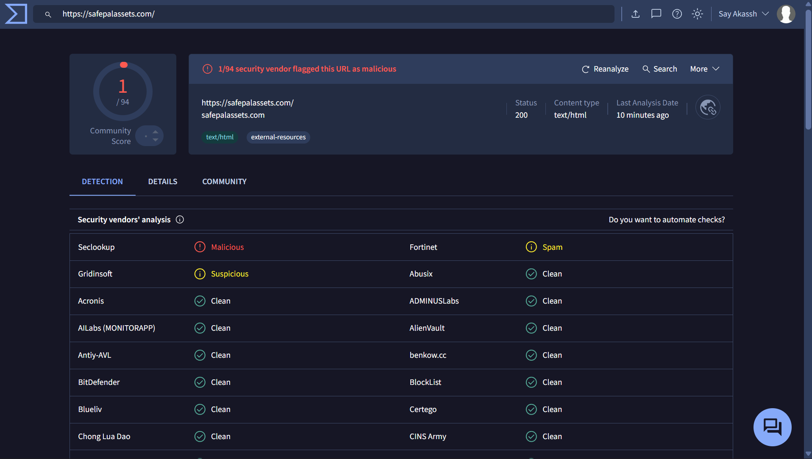

# Incident Report – Phishing URL Analysis

## 1. Alert Information
- Alert Source: PhishTank
- Date of Investigation: 20/02/2026
- Analyst: Akash Singh
- Severity: High
- Serving IP Address: 104.21.83.5

---

## 2. Alert Description
- It is observed by the limited vendors However, one vendor classified the domain as malicious and another as suspicious.
---

## 3. Investigation Steps Performed
1. Checked URL reputation on VirusTotal.
2. Reviewed detection ratio and vendor classifications.
3. Analyzed domain registration details via WHOIS lookup.
4. Reviewed hosting IP and country information.
5. Checked for brand impersonation indicators.

---

## 4. Findings

### 4.1 VirusTotal Analysis
- Detection Ratio: 1/94
- Vendors Flagged: 02
- Classification Type: malicious
- Content-type: text/html
- Server: cloudflare

### Observation:
- Based on the evidence,I analyse the link on virus total and it shows that the detection ratio is 1/94. One vendor (Seclookup) flagged the domain as malicious, while another vendor marked it as suspicious. The majority of security vendors reported the domain as clean.
- Low detection ratio may indicate early-stage malicious activity or limited reputation data.

### Domain Intelligence Observation:
- WHOIS lookup indicates that the domain was registered recently. Newly registered domains are frequently used in phishing campaigns due to their lack of reputation history.
- Naming Pattern: "safepalassets"
- The domain name appears to resemble the brand "SafePal," potentially indicating brand impersonation attempts.

### 4.2 Domain Intelligence
- Domain Creation Date: Thu, 19 Feb 2026 19:09:41 GMT
- OrgName: Cloudflare, Inc.
- OrgId: CLOUD14
- Address: 101 Townsend Street
- City: San Francisco
- StateProv: CA
- PostalCode: 94107
- Country: US
- First Submission: 2026-02-16 17:12:05 UTC
- Last Submission: 2026-02-19 19:09:27 UTC
- Last Analysis: 2026-02-19 19:09:27 UTC

---

## 5. Risk Assessment

The recent domain registration further increases the probability of malicious intent.
Risk Level: **High**
Based on vendor detection and domain characteristics, the URL is assessed as: https://safepalassets.com/

---

## 6. Impact Analysis
If accessed by end users, the domain may:
- Harvest login credentials
- Distribute malicious files
- Redirect users to additional phishing infrastructure
- Lead to financial or account compromise

---

## 7. Action Taken
- Recommended Actions:
- Block the domain at firewall and proxy level
- Add domain to email gateway blacklist
- Monitor for related subdomains
- Notify users about potential phishing attempts

---

## 8. Final Verdict
The domain demonstrates multiple phishing indicators and is confirmed malicious based on threat intelligence sources. Immediate blocking and escalation recommended.

## 9. Investigated Image 
- 
